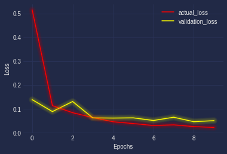
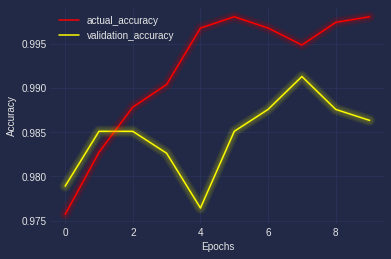
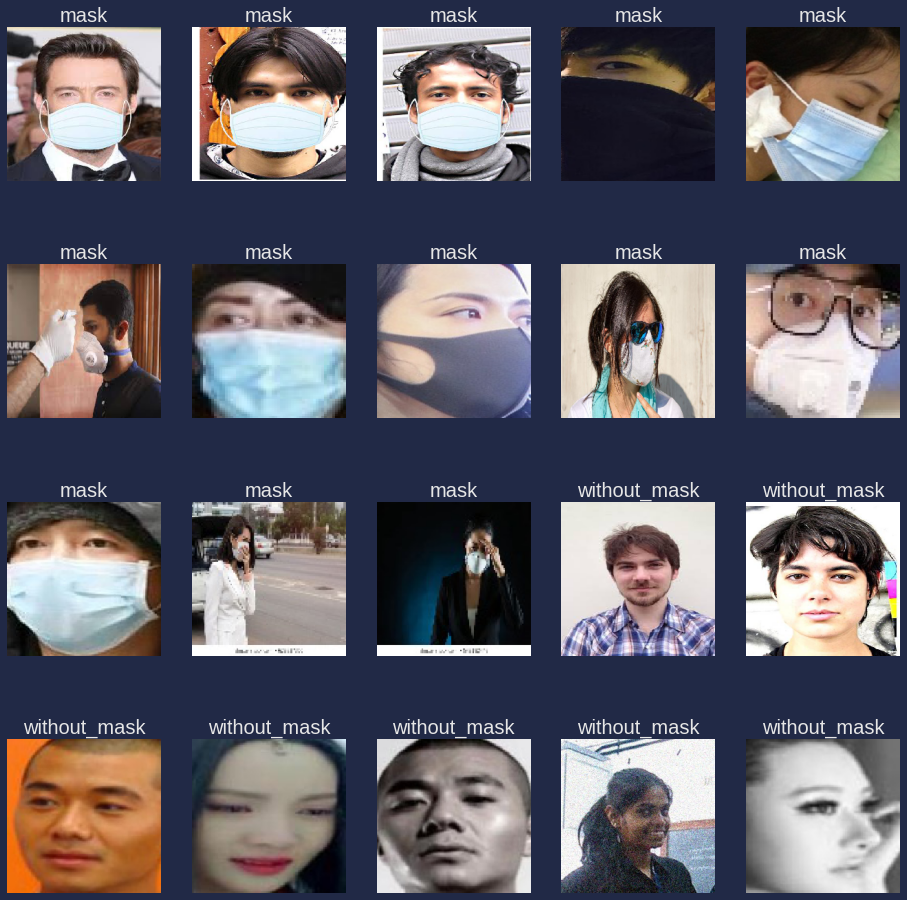
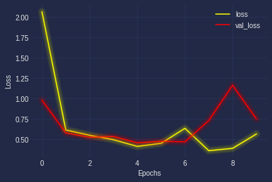
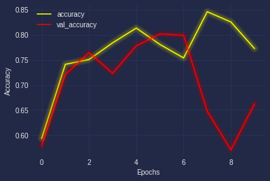
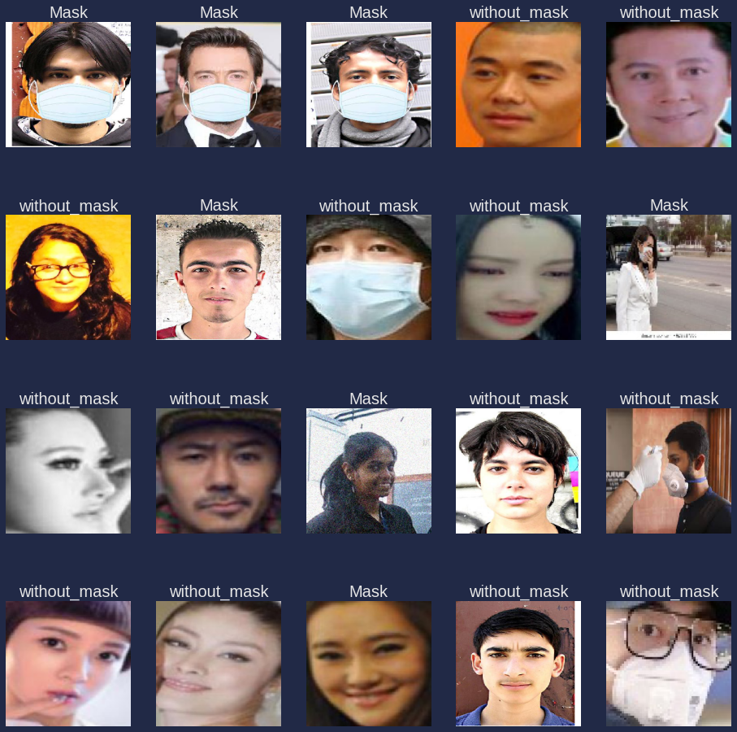

# TransferLearningMethods
Here i have used Transfer Learning method to predict whether a person is wearing a mask or not,
So i used 3 transfer learning methods,namely VGG architecture (VGG16,VGG19),Resnet50(Residual Networks) and Inception Model
The dataset which is used is Maskdetection dataset,which one can download easily from kaggle,so here i have not used images,
even as these models are very powerful and they work extremely well on huge datasets,as these models are trained for prediction 
1000 classes!!,i just wanted to know if i have a dataset of nearly 2000 images,which method would suit the best VGG,Resnet or Inception,
And when i observed the results,i found that VGG networks gave an excellent result,where as Resnet models did'nt and that's obvious,coz Resnet is built
to train highly complex models!!,here i have some stats about the loss,val_loss,accuracy,val_accuracy of different models

## VGG Model

###### Loss Curve:

Here i have trained the model for just 10 epochs,just to observe the bottle neck position,i can observe the trend,as the number of epochs are
increasing both validation and training loss are observed to be ↓

###### Accuracy Curve:

As we can observe from the graph that as the number of epochs are ↑,both validation and training accuracy are ↑,and there's very less
chance that the model will overfit,when i tested my vgg19 model on the testing dataset,the results were awesome,it was predicting very good,shown below ↓

## RESNET MODEL

###### Loss Curve:

Resnet model as mentioned earlier did'nt perform that good on this dataset,also the dataset which i used had nealry 2000 images,so resnet model typically
is used to solve classification problems where in the dataset contains more than 50000 images and so...it stilled worked fine,as we can observe in the loss curve

###### Accuracy Curve:

As mentioned earlier Resnet model did'nt give the best result as it can give,also i just trained my model for 10 epochs and the dataset was also small,we can clearly see that 
the model is kind of getting overfitted,may reduce overfitting if we ↑ the number of epochs and actually,it's of no use to ↑ the number of epochs,coz we're using such a strong
model for a small dataset!

The response of the model on the testing dataset is shown below ↓

So in this case the VGG network showed a great result,these transfer learning methods are one of the best methods available as they are trained on heavy datasets and are able 
to predict over 1000 classes ❤
